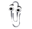

**As you start reading through this github profile there's a tiny explosion in your peripheral vision...**

> The shockwave ripples the skin on your face and for a moment you feel like a dog with its head out of a car window.
>
> As your vision clears, you notice a paperclip with eyes hovering in your eyeline. 
>
> 
>
> "Welcome to this github profile" it whispers threateningly.
> 
> "Would you mind starring a repo?" it asks politely, although its cold metallic eyes betray the command.
> 
> You've had enough. As you move to click the back button to leave the page the paperclip darts to your power output. Its conductive body is worryingly close to short circuiting your computer's power supply.
> 
> "Fine" it says passive aggressively.
> 
>It looks directly into your eyes as it inserts itself into the power outlet and starts sparking. Its body fireworks into a bright electric blue and with an explosion that looks like a minature Hiroshima mushrrom it takes out your harddrive and screen.
>
>Harrrowing. You were never the same again. 

### About Me:
👋 I currently build data pipelines and all the warehouse goodness that goes with them at a company Land Tech. Great team, lots of shell, typescript, python, sql, webscraping and cloudformation.
I'm currently quite backend and infra focused but dear lord I'm a sucker for a bit of react and a good css animation.

Feel free to browse my [CV](https://github.com/whatsrupp/CV) or any of the assorted rubbish that's on here. 

I'm trying to keep projects I care about up to date on [my website](https://www.nickrupp.co.uk/).

_Not all bugs are bad - here's a photo of a shield bug I found on a leaf in 2019. They're also known as stink bugs because they emit a zesty smell when frightened. Like a tiny skunk._

<!--
**whatsrupp/whatsrupp** is a ✨ _special_ ✨ repository because its `README.md` (this file) appears on your GitHub profile.

Here are some ideas to get you started:

- 🔭 I’m currently working on ...
- 🌱 I’m currently learning ...
- 👯 I’m looking to collaborate on ...
- 🤔 I’m looking for help with ...
- 💬 Ask me about ...
- 📫 How to reach me: ...
- 😄 Pronouns: ...
- ⚡ Fun fact: ...
-->
